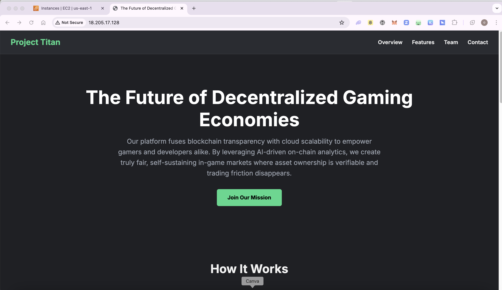

# Alt school second semester project

## Project Overview

This is a dynamic prototype of a landing page for a startup idea. Our platform fuses blockchain transparency with cloud scalability to empower gamers and developers alike. By leveraging AI-driven on-chain analytics, we create truly fair, self-sustaining in-game markets where asset ownership is verifiable and trading friction disappears.

This repository documents the end-to-end deployment of the project, demonstrating a complete cloud engineering workflow from server provisioning on AWS to a secure, production-ready deployment using a reverse proxy.

## Live Demonstration

The fully deployed application is accessible via the public IP address below.
**Live URL:** http://18.205.17.128

**Note:** This site is hosted directly on an IP address. As SSL certificates can only be issued for domain names, the browser will correctly show a "Not Secure" warning. This is expected behavior.

## Final Rendered Page

## Technology Stack

| Category            | Technology         | Purpose                                                      |
| ------------------- | ------------------ | ------------------------------------------------------------ |
| **Cloud Provider** | AWS EC2            | For provisioning a scalable and reliable virtual server.     |
| **Operating System**| Ubuntu 22.04 LTS   | A stable, widely-used Linux distribution for the server.     |
| **Web Server** | Nginx              | Serves as a high-performance web server and reverse proxy.   |
| **Application Runtime** | Node.js & Express  | To create a backend server that serves the static files.     |
| **Process Manager** | PM2                | To keep the Node.js application running continuously in the background. |
| **Frontend** | HTML, CSS          | For the structure and styling of the user-facing landing page. |
| **Version Control** | Git & GitHub       | For source code management and to facilitate deployment.     |

---

## Project Architecture (Nginx Reverse Proxy)

This project implements a professional reverse proxy architecture. Nginx acts as the public-facing entry point, handling all incoming web traffic on port 80. It then securely forwards these requests to a backend Node.js application running on an internal port (3000).

**Request Flow:**
`User's Browser → Public IP (Port 80) → Nginx Server → proxy_pass to Node.js App (Port 3000)`

This architecture provides key advantages:

-   **Security:** Hides the Node.js application from direct internet exposure.
-   **Stability:** Nginx can handle traffic while the Node.js app is restarted or updated.
-   **Performance:** Nginx is highly optimized and can handle many concurrent connections efficiently.

---

## Detailed Setup & Deployment Steps

The project was brought to life following these key phases:

### Phase 1: Server Provisioning (AWS)

-   **Instance Creation:** A free-tier `t2.micro` EC2 instance was provisioned on AWS to host the application.
-   **OS Selection:** Ubuntu Server 22.04 LTS was chosen for its stability and extensive community support.
-   **Security Group:** A security group was configured to act as a virtual firewall, with inbound rules created to allow traffic on:
    -   **SSH (Port 22):** For secure remote server administration via the terminal.
    -   **HTTP (Port 80):** To allow public access to the web server.
    -   **HTTPS (Port 443):** To allow secure web traffic, a necessary step for future SSL certificate implementation.

### Phase 2: Server Configuration

-   **Software Installation:** After connecting to the server via SSH, the core technology stack was installed using `apt` and `npm`:
    -   Nginx: `sudo apt install nginx`
    -   Node.js: Installed using NodeSource to get a modern version.
    -   PM2: `sudo npm install -g pm2` was used to install the process manager globally.
-   **Nginx Reverse Proxy Config:**
    -   A new Nginx server block was created at `/etc/nginx/sites-available/project-titan`.
    -   This configuration file tells Nginx to listen on port 80 and forward all requests to the Node.js application running on `http://localhost:3000` using the `proxy_pass` directive.
    -   The configuration was enabled by creating a symlink to `/etc/nginx/sites-enabled/`.

### Phase 3: Application Deployment

-   **Initial Deployment:** The project was deployed by cloning the GitHub repository directly into the `/var/www/html` directory on the server. This initial setup required `sudo` and a few ownership errors (dubious ownership, Permission denied) had to be resolved.
-   **Permissions Correction:** To enable a smooth deployment workflow, ownership of the `/var/www/html` directory was permanently changed to the `ubuntu` user and `www-data` group with `sudo chown -R ubuntu:www-data /var/w/www/html`. Permissions were set to `775`.
-   **Application Start:**
    -   The Node.js dependencies were installed with `npm install`.
    -   The `server.js` application was started and daemonized using the command `pm2 start server.js --name project-titan`.
-   **Continuous Deployment Workflow:** The standard workflow for all future updates is now simple:
    1.  Push new code changes to the `main` branch on GitHub.
    2.  SSH into the server and run `git pull origin main` inside the `/var/www/html` directory.